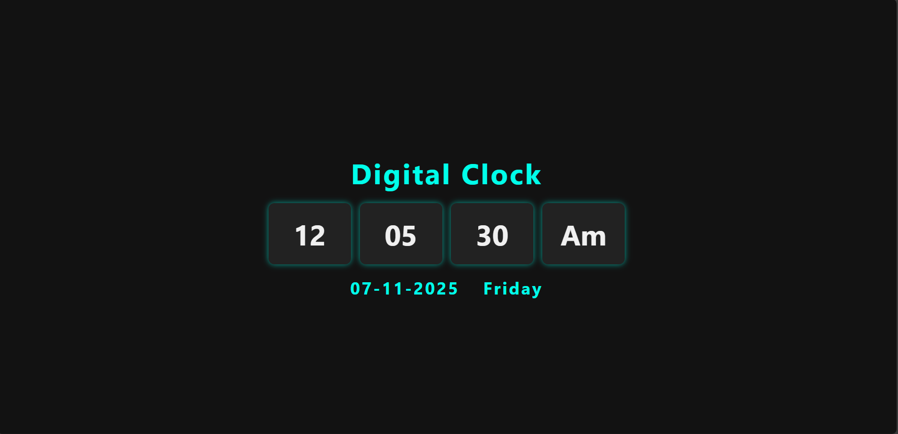

<!-- # React + Vite

This template provides a minimal setup to get React working in Vite with HMR and some ESLint rules.

Currently, two official plugins are available:

- [@vitejs/plugin-react](https://github.com/vitejs/vite-plugin-react/blob/main/packages/plugin-react) uses [Babel](https://babeljs.io/) for Fast Refresh
- [@vitejs/plugin-react-swc](https://github.com/vitejs/vite-plugin-react/blob/main/packages/plugin-react-swc) uses [SWC](https://swc.rs/) for Fast Refresh

## Expanding the ESLint configuration

If you are developing a production application, we recommend using TypeScript with type-aware lint rules enabled. Check out the [TS template](https://github.com/vitejs/vite/tree/main/packages/create-vite/template-react-ts) for information on how to integrate TypeScript and [`typescript-eslint`](https://typescript-eslint.io) in your project. -->
# Digital Clock ⏰

A simple and elegant digital clock built with **React.js** that displays real-time hours, minutes, seconds, AM/PM, current date, and day of the week.



---

## Features

- Real-time clock updating every second  
- 12-hour format with AM/PM indicator  
- Displays current date in `MM-DD-YYYY` format  
- Shows day of the week  
- Responsive and clean UI with CSS styling

---

## Technologies Used

- React.js (with Hooks)  
- JavaScript (ES6+)  
- CSS for styling

---

## Getting Started

### Prerequisites

Make sure you have **Node.js** and **npm** installed on your system.

### Installation & Running

```bash
git clone https://github.com/durgaofficial/Digital_Clock.git
cd Digital_Clock
npm install
npm run dev
